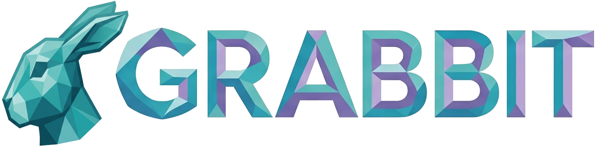
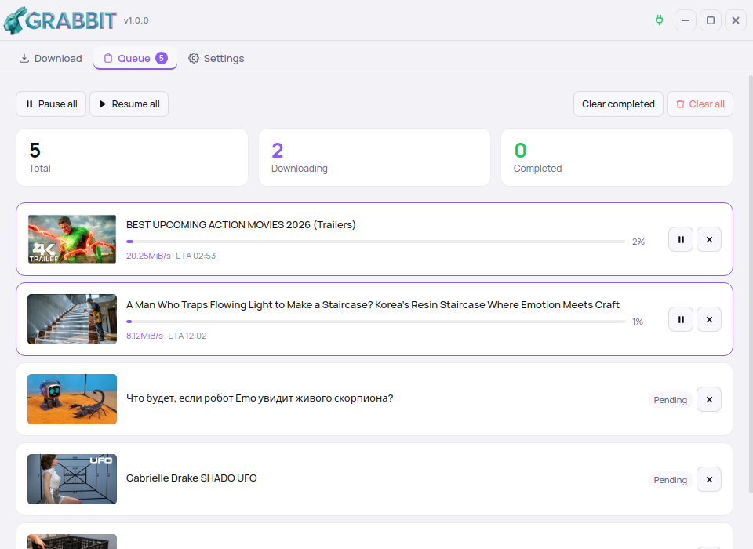

<p align="center">
  
</p>

<p align="center">
  A clean, fast desktop <strong>video download manager</strong> built on top of
  <a href="https://github.com/yt-dlp/yt-dlp">yt-dlp</a> — single videos or whole
  playlists, with a real download queue, native notifications, and a localized interface.
</p>

<p align="center">
  
  
  
  
  
  
  
</p>

<p align="center">
  
</p>


---

## Features

- **Single videos & playlists** — automatic link analysis with per-entry format selection.
- **Format control** — choose video quality and codec, audio quality and format, and subtitles, each independently.
- **Output container** — merge to **MP4** or **MKV**, as a global default or per download.
- **Subtitles** — download in SRT / ASS / VTT, optionally embedded in the file, including auto-generated captions.
- **Download queue** — concurrent downloads, pause/resume per item or for the whole queue, retry on error, and a clean-up for completed items. The queue is **persisted**, so it survives a restart.
- **Auto-start (optional)** — start downloads on add, or hold them in the queue until you press *Resume All*.
- **Per-download destination** — override the output folder for a single download.
- **Native notifications** — a system notification when a download finishes (only when the window isn't focused).
- **Advanced yt-dlp parameters** — an optional modal exposing extra yt-dlp options, with **savable presets**.
- **Localized** — interface available in **Italian, English, German, Spanish, French, and Portuguese**, with the language auto-detected from your system on first run.
- **Light & dark themes**.
- **Quality-of-life** — frameless custom window, close confirmation when work is in progress, configurable filename template, rate limiting, cookies and proxy support, and a diagnostics panel that opens the log folder.

---

## Requirements

- **FFmpeg** — required to merge separate video/audio streams and for format conversion. GRABBIT detects it automatically (system `PATH`, login-shell `PATH`, or common install locations); if it can't find it, a banner lets you set the path manually in **Settings → FFmpeg**.
  - Ubuntu/Debian/Mint: `sudo apt install ffmpeg`
  - Fedora: `sudo dnf install ffmpeg`
  - Arch: `sudo pacman -S ffmpeg`
- **yt-dlp** is bundled with the application — no separate install needed.

---

## Installation (Linux, AppImage)

Download the latest `GRABBIT-x86_64.AppImage` from the [Releases page](https://github.com/klode82/grabbit/releases), then:

```bash
chmod +x GRABBIT-x86_64.AppImage
./GRABBIT-x86_64.AppImage
```

That's it — the AppImage is self-contained and needs no installation. (Windows and macOS builds are planned.)

---

## Usage

1. **Paste a URL** into the input field and let GRABBIT analyze it.
2. **Pick your formats** — video quality/codec, audio, subtitles. Toggle off whatever you don't need.
3. **Add to queue** — downloads start immediately, or wait in the queue if auto-start is off.
4. **Manage the queue** — pause, resume, retry, or remove items from the *Queue* tab.

Defaults (output folder, filename template, formats, language, theme, FFmpeg path, and more) live under **Settings**.

---

## Configuration & data

GRABBIT stores its settings, queue, and log here:

- **Linux / macOS:** `~/.config/grabbit/`
- **Windows:** `%APPDATA%\grabbit\`

Files: `settings.json`, `queue.json`, `grabbit.log`. Deleting `settings.json` resets the app to defaults (and re-runs first-run language detection).

---

## Building from source

```bash
git clone https://github.com/klode82/grabbit.git
cd grabbit
python -m venv .venv
source .venv/bin/activate
pip install -r requirements.txt
python main.py
```

To produce the packaged AppImage you also need [`appimagetool`](https://github.com/AppImage/appimagetool/releases) on your `PATH`:

```bash
python build.py --appimage
```

`build.py` runs PyInstaller, prunes unused Qt modules to slim the bundle, and wraps the result into an AppImage. Useful flags: `--no-build`, `--no-prune`, `--appimage`.

---

## Tech stack

- **Backend:** Python · [pywebview](https://pywebview.flowrl.com/) (native window) · [FastAPI](https://fastapi.tiangolo.com/) + [uvicorn](https://www.uvicorn.org/) (local server) · [PySide6/Qt](https://doc.qt.io/qtforpython/) (WebEngine)
- **Download engine:** [yt-dlp](https://github.com/yt-dlp/yt-dlp) (used as a library)
- **Frontend:** vanilla HTML / CSS / JavaScript, with a small i18n engine and the [Manrope](https://github.com/sharanda/manrope) font
- **Packaging:** [PyInstaller](https://pyinstaller.org/) (onedir) → AppImage

---

## License

Released under the **MIT License** — see [`LICENSE`](LICENSE).

<!-- TODO: confirm the license and add the matching LICENSE file. -->

---

## Acknowledgements

GRABBIT stands on the shoulders of **yt-dlp** and **FFmpeg** — the projects that do the heavy lifting. Thank you to their maintainers.
